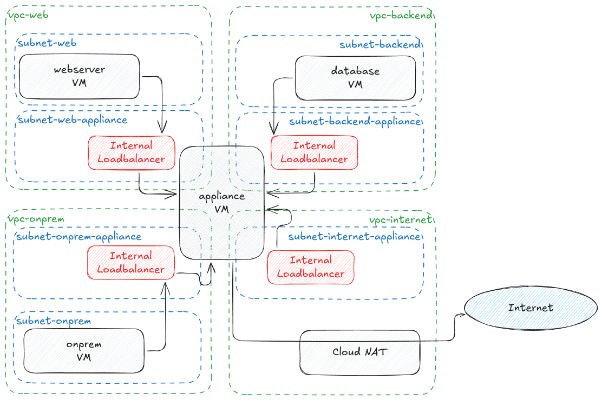

# Multiple Network Interfaces

This example is loosely based on the `Use case: Interconnect multiple networks to a virtual appliance` slide in the 2025 GCP Networking Fundamentals training.

## Caveats

- This setup is for demo and training purposes only. Do not run production on it!
- Due to the usage of an unmanaged instance group for the appliance, a second `terraform apply` is needed to re-add the `appliance` vm back to the group after recreating the VM:
  - During the `plan` in which the `appliance` vm is recreated, the instance group already contains the self_link to the vm
  - Terraform does flag the group as `(known after apply)`, however, the target_link will remain the same after the instance recreate, therefore not triggering an update.
  - Google does remove the instance from the instance group, therefore requiring a re-run of `terraform apply` to re-add the instance back to the instance group
- The `webserver`, `database`, and `onprem` instances have a startup script to install a basic webserver. This install will only succeed if the `appliance` vm and Cloud NAT are fully up and running.

## Deploy this example

1. To deploy this example, make sure you have terraform 1.9 or newer installed.
2. Copy `../defaults.auto.tfvars.example` to `../defaults.auto.tfvars` and fill in the variables
3. Make sure you locally have valid Application Default Credentials by executing `gcloud auth application-default login`
4. Run `terraform apply -target "terraform_data.network_setup"` to set up the core networking components
5. Run `terraform apply` to deploy all other components

Don't forget to clean it up afterwards.
You can do this by executing `terraform apply -destroy`

## Architecture

This example contains 4 dummy networks:

1. `internet`: Internet egress via Cloud NAT
2. `web`: Web servers (can be placed behind a global application loadbalancer)
3. `backend`: Backend servers
4. `onprem`: Simulate a connection to an on-prem network



_The diagram can be imported directly into [Excalidraw](https://excalidraw.com)_

## Routing

This example has a simplistic network layout and set of routing rules.
Each network has a Class B range (`/16`) assigned, with the exception of the `onprem` network, which has the "full" class A (`10.0.0.0/8`) minus the first 3 Class B ranges.

The routing table of the `appliance` vm looks like:

```bash
$ ip route
default via 10.0.0.1 dev ens4 proto dhcp src 10.0.0.3 metric 100
10.0.0.0/24 via 10.0.0.1 dev ens4 proto dhcp src 10.0.0.3 metric 100
10.0.0.0/16 via 10.0.0.1 dev ens4
10.0.0.0/8 via 10.3.0.1 dev ens7
10.0.0.1 dev ens4 proto dhcp scope link src 10.0.0.3 metric 100
10.1.0.0/24 via 10.1.0.1 dev ens5 proto dhcp src 10.1.0.3 metric 100
10.1.0.0/16 via 10.1.0.1 dev ens5
10.1.0.1 dev ens5 proto dhcp scope link src 10.1.0.3 metric 100
10.2.0.0/24 via 10.2.0.1 dev ens6 proto dhcp src 10.2.0.3 metric 100
10.2.0.0/16 via 10.2.0.1 dev ens6
10.2.0.1 dev ens6 proto dhcp scope link src 10.2.0.3 metric 100
10.3.0.0/24 via 10.3.0.1 dev ens7 proto dhcp src 10.3.0.3 metric 100
10.3.0.1 dev ens7 proto dhcp scope link src 10.3.0.3 metric 100
169.254.169.254 via 10.0.0.1 dev ens4 proto dhcp src 10.0.0.3 metric 100
```

With the exception of the `internet` network, all VPCs have a Custom Route for `0.0.0.0/0` to the Internal Passthrough Loadbalancer pointing to the `appliance` vm.
The `internet` VPC has `0.0.0.0/0` pointed to the `Default Internet Gateway` to allow Cloud NAT to connect to the internet.


## IP Address Management

Each network has a Class B range (`/16`) assigned, with the first Class C (`/24`) assigned to the routing `appliance` subnet.
The first usable ip address in the `appliance` subnets (`10.x.0.2/32`) is assigned to an Internal Passthrough Loadbalancer.
This loadbalancer allows for multiple Compute Instances to act as networking/routing/firewall appliance.

This layout was chosen to optimize on routing rules inside the `appliance` vm.

Multiple appliances are outside the scope of this example.

## Appliance VM

The `appliance` VM is based on a standard Debian 12 image, with a minimal set of `iptables` and `ip route` rules.
It does NAT for the default interface (`ens4`), to make sure return packets from Cloud NAT are properly routed back without triggering martian packet filtering.

Please note that the instance has 4 vCPUs assigned in order to have 4 network interface cards.

## On Prem

The `onprem` network contains a dummy instance to simulate an on-prem environment.
In real-life deployments, this network will host VPN Gateways or Interconnect attachments.

## Allowed traffic

- All instances can `ping` all other instances
- All instances can connect to the internet
- The `appliance` vm can connect to any instance on any protocol/port
- The `webserver` vm can `curl` the `onprem` instance via port 80 (`http`)
