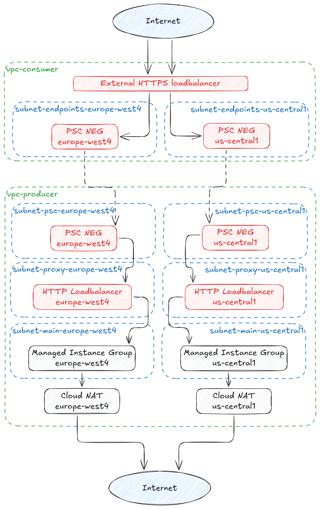

# External HTTPS loadbalancer with producers in another network

This example is loosely based on the `Sample topology: Using a global external Application Load Balancer with PSC` slide in the 2025 GCP Networking Private Connection Options training.

## Caveats

- This setup is for demo and training purposes only. Do not run production on it!
- This example relies on the external service `nip.io` to generate Google managed certificates on valid domain names
  - It may take 15 minutes (or more) before the certificate becomes available and the external HTTPS loadbalancer to become healthy
- The producer uses instance templates, which can be updated by simultaniously updating the template and the version number
  - Updating the template doesn't replace the virtual machines
  - Virtual machines can be replaced by selecting the appropriate update trategy inside the `Instance Group` -> `Update VMs` page

## Deploy this example

1. To deploy this example, make sure you have terraform 1.9 or newer installed.
2. Copy `../defaults.auto.tfvars.example` to `../defaults.auto.tfvars` and fill in the variables
3. Make sure you locally have valid Application Default Credentials by executing `gcloud auth application-default login`
4. Run `terraform apply` to deploy all components
5. Wait until the certificate is made available
6. Open one of the urls form the terraform output in your favourite browser/commandline tool

Don't forget to clean it up afterwards.
You can do this by executing `terraform apply -destroy`

## Architecture

This example contains 2 networks:

1. `consumer`: This network only contains the global HTTPS loadbalancer (and required components)
2. `producer`: This is a multi-regional producer service, which only required outbound (egress) traffic for setting up the VMs

_The diagram can be imported directly into [Excalidraw](https://excalidraw.com)_

## Global routing

When a client accesses the main domain (`https://[IP_ADDRESS].nip.io`), the request gets routed to the nearest healthy endpoint.
Clients in Europe and Africa are most likely to be routed to `europe-west4`.
Clients in the Americas are most likely to be routed to `us-central1`.
Clients in Asia and Oceania will most likely be routed to the geographically closest region, and may alternate between regions in subsequent requests.

## Regional routing

Each region also has a regional domain available, which ensures the traffic is sent to that region: (`https://[REGION].[IP_ADDRESS].nip.io`)

## Supporting cross-regional and global requests

By default PSC endpoints are only reachable in their own region.
This behaviour can be changed by setting the `allow_global_access` flag to `true` on the `google_compute_forwarding_rule` exposing the service to the `producer` side of the PSC link.
